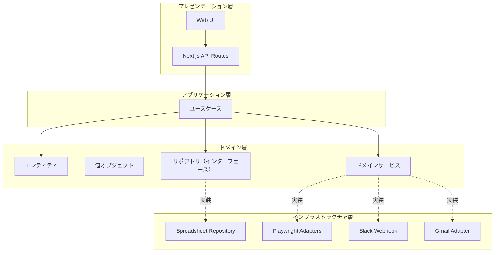
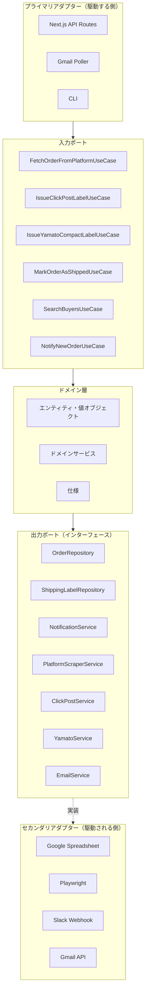
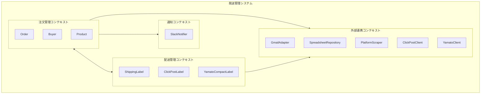
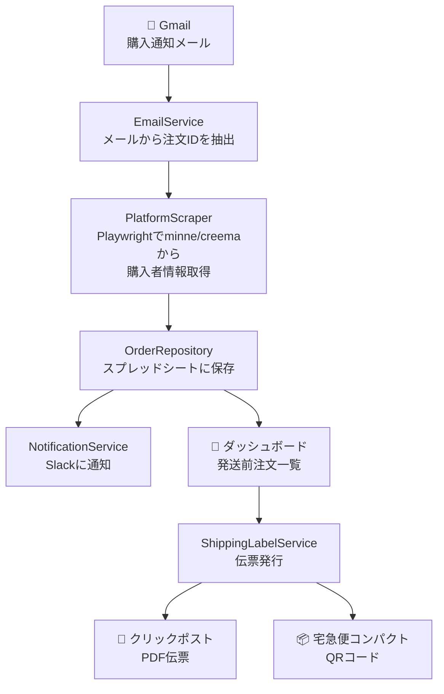

# アーキテクチャ

## 概要

ハンドメイド発送管理システムのアーキテクチャを定義します。
ヘキサゴナルアーキテクチャ（Ports and Adapters）を採用し、ドメイン層を中心に据えた疎結合な設計を目指します。

## レイヤー構成



## ヘキサゴナルアーキテクチャ



## 依存関係のルール

```
プレゼンテーション層 → アプリケーション層 → ドメイン層 ← インフラストラクチャ層
```

- **ドメイン層は他の層に依存しない**
- インフラストラクチャ層はドメイン層のインターフェースを実装する（依存性逆転）
- アプリケーション層はドメイン層のインターフェースを通じてインフラストラクチャ層を利用する

## コンテキストマップ



## データフロー



## 技術スタック

| レイヤー | 技術 |
|---------|------|
| プレゼンテーション層 | Next.js, React, shadcn/ui, TailwindCSS |
| アプリケーション層 | Next.js API Routes |
| ドメイン層 | TypeScript |
| インフラストラクチャ層 | Google Sheets API, Gmail API, Playwright, Slack Webhook |

## ディレクトリ構成（予定）

```
src/
├── presentation/          # プレゼンテーション層
│   ├── components/        # UIコンポーネント
│   └── pages/             # Next.js pages
│
├── application/           # アプリケーション層
│   └── usecases/          # ユースケース
│
├── domain/                # ドメイン層
│   ├── entities/          # エンティティ
│   ├── valueObjects/      # 値オブジェクト
│   ├── services/          # ドメインサービス
│   ├── repositories/      # リポジトリインターフェース
│   └── specifications/    # 仕様
│
└── infrastructure/        # インフラストラクチャ層
    ├── repositories/      # リポジトリ実装
    ├── adapters/          # 外部サービスアダプター
    │   ├── playwright/    # Playwright関連
    │   ├── gmail/         # Gmail API
    │   └── slack/         # Slack Webhook
    └── config/            # 設定
```

## 関連ドキュメント

- [ドメインモデル](../domain/README.md)
- [ユースケース](../usecases/README.md)
