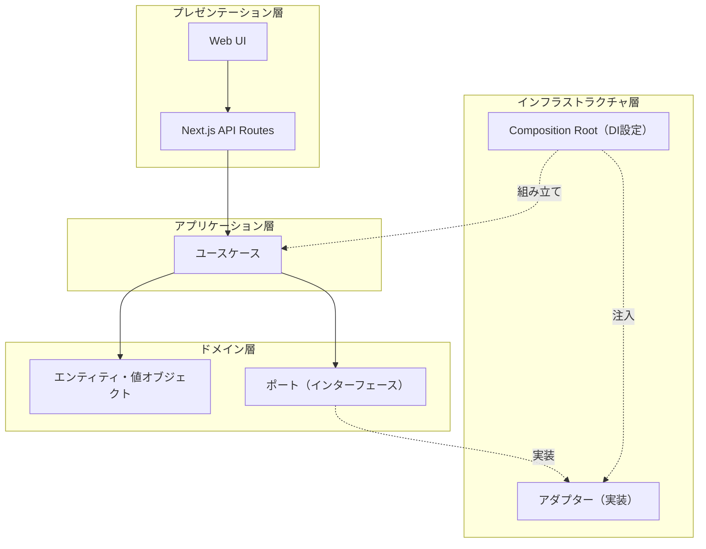
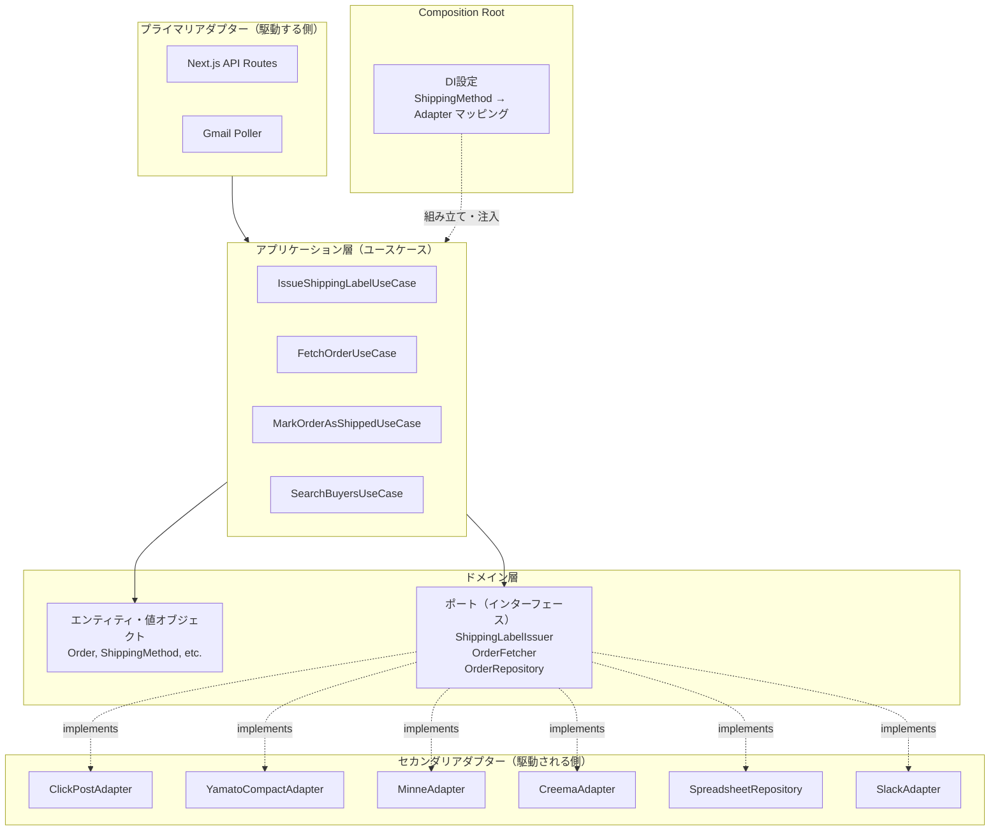
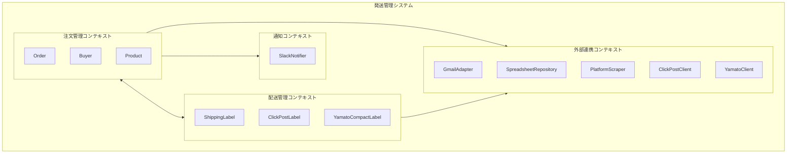
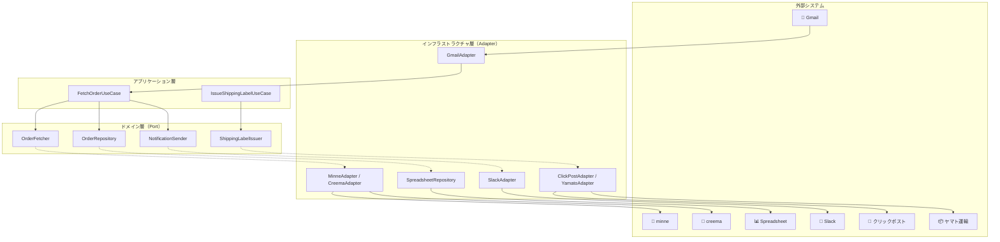

# アーキテクチャ

## 概要

ハンドメイド発送管理システムのアーキテクチャを定義します。
ヘキサゴナルアーキテクチャ（Ports and Adapters）を採用し、ドメイン層を中心に据えた疎結合な設計を目指します。

## レイヤー構成



## ヘキサゴナルアーキテクチャ



## 依存関係のルール

```
プレゼンテーション層 → アプリケーション層 → ドメイン層 ← インフラストラクチャ層
```

### 基本原則

- **ドメイン層は他の層に依存しない**（最も内側）
- **ドメイン層がインターフェース（Port）を定義する**
- **インフラストラクチャ層がインターフェースを実装する**（依存性逆転）
- **ユースケースは抽象（Port）にのみ依存し、具体実装（Adapter）を知らない**

### 依存性逆転の例：伝票発行

```typescript
// ❌ 避けるべき：ユースケースが具体実装に依存
class IssueShippingLabelUseCase {
  constructor(
    private clickPostAdapter: ClickPostAdapter,  // 具体実装をimport
    private yamatoAdapter: YamatoCompactAdapter, // 具体実装をimport
  ) {}
}

// ✅ 正しい：ユースケースは抽象にのみ依存
class IssueShippingLabelUseCase {
  constructor(
    private labelIssuer: ShippingLabelIssuer, // ドメイン層で定義されたPort
  ) {}

  execute(order: Order, method: ShippingMethod): Promise<ShippingLabel> {
    return this.labelIssuer.issue(order, method);
  }
}
```

### Composition Root（DI設定）

ShippingMethod → Adapter のマッピングはComposition Root（アプリケーションの起動時）で行う。

```typescript
// infrastructure/di/container.ts
const container = {
  // ShippingMethod に応じた Adapter を返すファクトリ
  shippingLabelIssuer: (method: ShippingMethod): ShippingLabelIssuer => {
    switch (method) {
      case ShippingMethod.ClickPost:
        return new ClickPostAdapter();
      case ShippingMethod.YamatoCompact:
        return new YamatoCompactAdapter();
      // 将来: case ShippingMethod.Sagawa: return new SagawaAdapter();
    }
  },
};
```

この設計により：
- **ユースケースは配送方法の追加・変更の影響を受けない**
- **新しい配送方法（例：佐川）の追加はインフラ層とDI設定の変更のみ**
- **テスト時はモックを注入可能**

## コンテキストマップ



## データフロー



## 技術スタック

| レイヤー | 技術 |
|---------|------|
| プレゼンテーション層 | Next.js, React, shadcn/ui, TailwindCSS |
| アプリケーション層 | Next.js API Routes |
| ドメイン層 | TypeScript |
| インフラストラクチャ層 | Google Sheets API, Gmail API, Playwright, Slack Webhook |

## ディレクトリ構成（予定）

```
src/
├── presentation/           # プレゼンテーション層
│   ├── components/         # UIコンポーネント
│   └── pages/              # Next.js pages
│
├── application/            # アプリケーション層
│   └── usecases/           # ユースケース（Portにのみ依存）
│       ├── FetchOrderUseCase.ts
│       ├── IssueShippingLabelUseCase.ts
│       └── MarkOrderAsShippedUseCase.ts
│
├── domain/                 # ドメイン層（最も内側、依存なし）
│   ├── entities/           # エンティティ
│   │   ├── Order.ts
│   │   └── ShippingLabel.ts
│   ├── valueObjects/       # 値オブジェクト
│   │   ├── ShippingMethod.ts    # click_post / yamato_compact
│   │   ├── Platform.ts          # minne / creema
│   │   └── ...
│   ├── ports/              # ポート（インターフェース定義）
│   │   ├── ShippingLabelIssuer.ts
│   │   ├── OrderFetcher.ts
│   │   ├── OrderRepository.ts
│   │   └── NotificationSender.ts
│   └── specifications/     # 仕様
│
└── infrastructure/         # インフラストラクチャ層（Portを実装）
    ├── adapters/           # アダプター（Port実装）
    │   ├── shipping/
    │   │   ├── ClickPostAdapter.ts      # implements ShippingLabelIssuer
    │   │   └── YamatoCompactAdapter.ts  # implements ShippingLabelIssuer
    │   ├── platform/
    │   │   ├── MinneAdapter.ts          # implements OrderFetcher
    │   │   └── CreemaAdapter.ts         # implements OrderFetcher
    │   ├── notification/
    │   │   └── SlackAdapter.ts          # implements NotificationSender
    │   └── persistence/
    │       └── SpreadsheetRepository.ts # implements OrderRepository
    ├── di/                 # Composition Root
    │   └── container.ts    # DI設定、ShippingMethod→Adapterマッピング
    └── external/           # 外部ライブラリラッパー
        ├── playwright/
        └── google/
```

## 関連ドキュメント

- [ドメインモデル](../domain/README.md)
- [ユースケース](../usecases/README.md)
