# アーキテクチャ

## 概要

ハンドメイド発送管理システムのアーキテクチャを定義します。
ヘキサゴナルアーキテクチャ（Ports and Adapters）を採用し、ドメイン層を中心に据えた疎結合な設計を目指します。

## レイヤー構成

```mermaid
flowchart TB
    subgraph Presentation["プレゼンテーション層"]
        NextAPI["Next.js API Routes"]
        WebUI["Web UI"]
    end

    subgraph Application["アプリケーション層"]
        UC["ユースケース"]
    end

    subgraph Domain["ドメイン層"]
        Entity["エンティティ・値オブジェクト"]
        Port["ポート（インターフェース）"]
    end

    subgraph Infrastructure["インフラストラクチャ層"]
        Adapter["アダプター（実装）"]
        CompositionRoot["Composition Root（DI設定）"]
    end

    WebUI --> NextAPI
    NextAPI --> UC
    UC --> Entity
    UC --> Port
    Port -.->|実装| Adapter
    CompositionRoot -.->|組み立て| UC
    CompositionRoot -.->|注入| Adapter
```



## ヘキサゴナルアーキテクチャ

```mermaid
flowchart TB
    subgraph PrimaryAdapters["プライマリアダプター（駆動する側）"]
        NextJS["Next.js API Routes"]
        GmailPoller["Gmail Poller"]
    end

    subgraph Application["アプリケーション層（ユースケース）"]
        IssueLabel["IssueShippingLabelUseCase"]
        FetchOrder["FetchOrderUseCase"]
        MarkShipped["MarkOrderAsShippedUseCase"]
        SearchBuyers["SearchBuyersUseCase"]
    end

    subgraph Domain["ドメイン層"]
        Entities["エンティティ・値オブジェクト<br/>Order, ShippingMethod, etc."]
        Ports["ポート（インターフェース）<br/>ShippingLabelIssuer<br/>OrderFetcher<br/>OrderRepository<br/>ShippingLabelRepository<br/>MessageTemplateRepository<br/>NotificationSender"]
    end

    subgraph SecondaryAdapters["セカンダリアダプター（駆動される側）"]
        ClickPostAdapter["ClickPostAdapter"]
        YamatoAdapter["YamatoCompactAdapter"]
        MinneAdapter["MinneAdapter"]
        CreemaAdapter["CreemaAdapter"]
        SpreadsheetRepo["SpreadsheetRepository"]
        SlackAdapter["SlackAdapter"]
    end

    subgraph CompositionRoot["Composition Root"]
        DI["DI設定<br/>ShippingMethod → Adapter マッピング"]
    end

    PrimaryAdapters --> Application
    Application --> Entities
    Application --> Ports
    Ports -.->|implements| ClickPostAdapter
    Ports -.->|implements| YamatoAdapter
    Ports -.->|implements| MinneAdapter
    Ports -.->|implements| CreemaAdapter
    Ports -.->|implements| SpreadsheetRepo
    Ports -.->|implements| SlackAdapter
    DI -.->|組み立て・注入| Application
```



## 依存関係のルール

```
プレゼンテーション層 → アプリケーション層 → ドメイン層 ← インフラストラクチャ層
```

### 基本原則

- **ドメイン層は他の層に依存しない**（最も内側）
- **ドメイン層がインターフェース（Port）を定義する**
- **インフラストラクチャ層がインターフェースを実装する**（依存性逆転）
- **ユースケースは抽象（Port）にのみ依存し、具体実装（Adapter）を知らない**

### 依存性逆転の例：伝票発行

```typescript
// ❌ 避けるべき：ユースケースが具体実装に依存
class IssueShippingLabelUseCase {
  constructor(
    private clickPostAdapter: ClickPostAdapter,  // 具体実装をimport
    private yamatoAdapter: YamatoCompactAdapter, // 具体実装をimport
  ) {}
}

// ✅ 正しい：ユースケースは抽象にのみ依存
class IssueShippingLabelUseCase {
  constructor(
    private labelIssuer: ShippingLabelIssuer, // ドメイン層で定義されたPort
  ) {}

  execute(order: Order, method: ShippingMethod): Promise<ShippingLabel> {
    return this.labelIssuer.issue(order, method);
  }
}
```

### Composition Root（DI設定）

ShippingMethod → Adapter のマッピングはComposition Root（アプリケーションの起動時）で行う。

```typescript
// infrastructure/di/container.ts
const container = {
  // ShippingMethod に応じた Adapter を返すファクトリ
  shippingLabelIssuer: (method: ShippingMethod): ShippingLabelIssuer => {
    switch (method) {
      case ShippingMethod.ClickPost:
        return new ClickPostAdapter();
      case ShippingMethod.YamatoCompact:
        return new YamatoCompactAdapter();
      // 将来: case ShippingMethod.Sagawa: return new SagawaAdapter();
    }
  },
};
```

この設計により：
- **ユースケースは配送方法の追加・変更の影響を受けない**
- **新しい配送方法（例：佐川）の追加はインフラ層とDI設定の変更のみ**
- **テスト時はモックを注入可能**

## コンテキストマップ

```mermaid
flowchart TB
    subgraph System["発送管理システム"]
        subgraph OrderContext["注文管理コンテキスト"]
            Order["Order"]
            Buyer["Buyer"]
            Product["Product"]
        end

        subgraph ShippingContext["配送管理コンテキスト"]
            ShippingLabel["ShippingLabel"]
            ClickPost["ClickPostLabel"]
            YamatoCompact["YamatoCompactLabel"]
        end

        subgraph NotificationContext["通知コンテキスト"]
            SlackNotifier["SlackNotifier"]
        end

        subgraph ExternalContext["外部連携コンテキスト"]
            GmailAdapterCtx["GmailAdapter"]
            SpreadsheetRepo["SpreadsheetRepository"]
            PlatformScraperCtx["PlatformScraper"]
            ClickPostClient["ClickPostClient"]
            YamatoClient["YamatoClient"]
        end
    end

    OrderContext <--> ShippingContext
    OrderContext --> NotificationContext
    OrderContext --> ExternalContext
    ShippingContext --> ExternalContext
```



## データフロー

```mermaid
flowchart TD
    subgraph External["外部システム"]
        Gmail["📧 Gmail"]
        Minne["🛒 minne"]
        Creema["🛒 creema"]
        ClickPostSite["📮 クリックポスト"]
        YamatoSite["📦 ヤマト運輸"]
        Slack["💬 Slack"]
        Spreadsheet["📊 Spreadsheet"]
    end

    subgraph Adapters["インフラストラクチャ層（Adapter）"]
        GmailAdapter["GmailAdapter"]
        PlatformAdapter["MinneAdapter / CreemaAdapter"]
        LabelAdapter["ClickPostAdapter / YamatoAdapter"]
        SlackAdapter["SlackAdapter"]
        SpreadsheetRepo["SpreadsheetRepository"]
    end

    subgraph Ports["ドメイン層（Port）"]
        OrderFetcher["OrderFetcher"]
        LabelIssuer["ShippingLabelIssuer"]
        NotificationSender["NotificationSender"]
        OrderRepository["OrderRepository"]
    end

    subgraph UseCase["アプリケーション層"]
        FetchOrderUC["FetchOrderUseCase"]
        IssueLabelUC["IssueShippingLabelUseCase"]
    end

    Gmail --> GmailAdapter
    GmailAdapter --> FetchOrderUC
    FetchOrderUC --> OrderFetcher
    OrderFetcher -.-> PlatformAdapter
    PlatformAdapter --> Minne
    PlatformAdapter --> Creema
    FetchOrderUC --> OrderRepository
    OrderRepository -.-> SpreadsheetRepo
    SpreadsheetRepo --> Spreadsheet
    FetchOrderUC --> NotificationSender
    NotificationSender -.-> SlackAdapter
    SlackAdapter --> Slack

    IssueLabelUC --> LabelIssuer
    LabelIssuer -.-> LabelAdapter
    LabelAdapter --> ClickPostSite
    LabelAdapter --> YamatoSite
```



## 技術スタック

| レイヤー | 技術 |
|---------|------|
| プレゼンテーション層 | Next.js, React, shadcn/ui, TailwindCSS |
| アプリケーション層 | Next.js API Routes |
| ドメイン層 | TypeScript |
| インフラストラクチャ層 | Google Sheets API, Gmail API, Playwright, Slack Webhook |

## ディレクトリ構成（予定）

```
src/
├── presentation/               # プレゼンテーション層
│   ├── components/             # UIコンポーネント
│   └── pages/                  # Next.js pages
│
├── application/                # アプリケーション層
│   └── usecases/               # ユースケース（Portにのみ依存）
│       ├── FetchOrderUseCase.ts              # UC-001
│       ├── NotifyNewOrderUseCase.ts          # UC-002
│       ├── ListPendingOrdersUseCase.ts       # UC-003
│       ├── IssueShippingLabelUseCase.ts      # UC-004/005
│       ├── MarkOrderAsShippedUseCase.ts      # UC-006
│       ├── SearchBuyersUseCase.ts            # UC-007
│       ├── GeneratePurchaseThanksUseCase.ts  # UC-008
│       ├── GenerateShippingNoticeUseCase.ts  # UC-009
│       └── UpdateMessageTemplateUseCase.ts   # UC-010
│
├── domain/                     # ドメイン層（最も内側、依存なし）
│   ├── entities/               # エンティティ
│   │   ├── Order.ts
│   │   ├── ShippingLabel.ts
│   │   ├── ClickPostLabel.ts
│   │   └── YamatoCompactLabel.ts
│   ├── valueObjects/           # 値オブジェクト
│   │   ├── OrderId.ts
│   │   ├── LabelId.ts
│   │   ├── Platform.ts              # minne / creema
│   │   ├── OrderStatus.ts           # pending / shipped
│   │   ├── ShippingMethod.ts        # click_post / yamato_compact
│   │   ├── BuyerName.ts
│   │   ├── PostalCode.ts
│   │   ├── Prefecture.ts
│   │   ├── PhoneNumber.ts
│   │   ├── TrackingNumber.ts
│   │   ├── Address.ts
│   │   ├── Buyer.ts
│   │   ├── Product.ts
│   │   ├── Message.ts
│   │   └── MessageTemplateType.ts   # purchase_thanks / shipping_notice
│   ├── ports/                  # ポート（インターフェース定義）
│   │   ├── OrderRepository.ts
│   │   ├── ShippingLabelRepository.ts
│   │   ├── MessageTemplateRepository.ts
│   │   ├── ShippingLabelIssuer.ts
│   │   ├── OrderFetcher.ts
│   │   └── NotificationSender.ts
│   ├── services/               # ドメインサービス
│   │   └── MessageGenerator.ts
│   ├── specifications/         # 仕様
│   │   └── OverdueOrderSpecification.ts
│   └── factories/              # ファクトリ
│       └── OrderFactory.ts
│
└── infrastructure/             # インフラストラクチャ層（Portを実装）
    ├── adapters/               # アダプター（Port実装）
    │   ├── shipping/
    │   │   ├── ClickPostAdapter.ts         # implements ClickPostGateway
    │   │   ├── YamatoCompactAdapter.ts     # implements YamatoCompactGateway
    │   │   └── ShippingLabelIssuerImpl.ts  # implements ShippingLabelIssuer
    │   ├── platform/
    │   │   ├── MinneAdapter.ts             # implements OrderFetcher
    │   │   └── CreemaAdapter.ts            # implements OrderFetcher
    │   ├── notification/
    │   │   └── SlackAdapter.ts             # implements NotificationSender
    │   └── persistence/
    │       ├── SpreadsheetOrderRepository.ts          # implements OrderRepository
    │       ├── SpreadsheetShippingLabelRepository.ts  # implements ShippingLabelRepository
    │       └── LocalStorageMessageTemplateRepository.ts # implements MessageTemplateRepository
    ├── di/                     # Composition Root
    │   └── container.ts        # DI設定、ShippingMethod→Adapterマッピング
    └── external/               # 外部ライブラリラッパー
        ├── playwright/
        └── google/
```

## 関連ドキュメント

- [ドメインモデル](../domain/README.md)
- [ユースケース](../usecases/README.md)

## Spreadsheet Deserialize Error Handling

永続化アダプター（`SpreadsheetOrderRepository` / `SpreadsheetShippingLabelRepository`）の
デシリアライズ失敗時は、以下の方針を採用する。

- 方針: `スキップ + ログ`
- 理由: シート上の1行破損で一覧取得全体を止めず、運用を継続できるため
- 実装: 破損行は `console.warn` で `row番号` と `ID` を記録し、その行だけ除外

この方針は `SpreadsheetOrderRepository` で実装済みで、
`SpreadsheetShippingLabelRepository` でも同じエラーハンドリング（行単位スキップ）を
適用できる。
