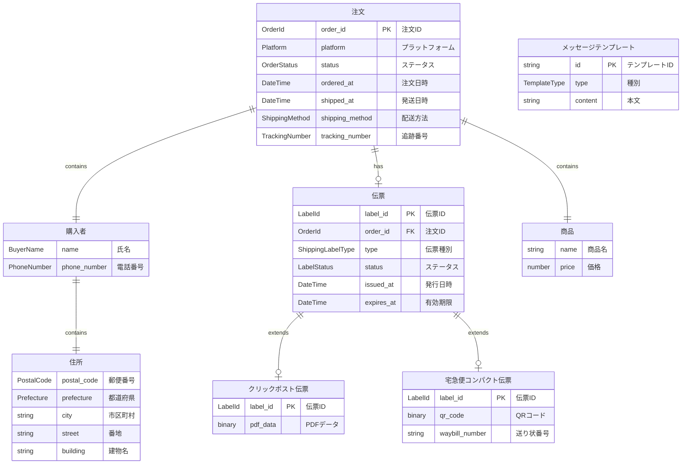

# ドメインモデル

## 概要

松岡幸一郎氏の「ドメイン駆動設計入門」に基づき、ハンドメイド発送管理システムのドメインモデルを定義します。

## ユビキタス言語（Ubiquitous Language）

| 用語 | 英語 | 定義 |
|-----|------|------|
| 注文 | Order | ハンドメイドプラットフォームでの購入を表す |
| 購入者 | Buyer | 作品を購入した人 |
| 作家 | Creator | ハンドメイド作品を制作・販売する人 |
| 伝票 | Shipping Label | 配送に使用する送り状 |
| 発送 | Shipment | 作品を購入者に送ること |
| プラットフォーム | Platform | minne、creemaなどの販売サイト |
| クリックポスト | Click Post | 日本郵便の配送サービス |
| 宅急便コンパクト | Takkyubin Compact | ヤマト運輸の配送サービス |
| PUDO | PUDO | 宅配便ロッカー |

## ER図



## コンテキストマップ

```
┌─────────────────────────────────────────────────────────────────────────┐
│                         発送管理システム                                 │
├─────────────────────────────────────────────────────────────────────────┤
│                                                                         │
│  ┌─────────────────────┐           ┌─────────────────────┐            │
│  │    注文管理          │           │    配送管理          │            │
│  │   (Order Context)    │◄─────────►│  (Shipping Context)  │            │
│  │                     │           │                     │            │
│  │  - Order            │           │  - ShippingLabel    │            │
│  │  - Buyer            │           │  - ClickPost        │            │
│  │  - Product          │           │  - YamatoCompact    │            │
│  └─────────────────────┘           └─────────────────────┘            │
│           ▲                                  ▲                        │
│           │                                  │                        │
│           ▼                                  ▼                        │
│  ┌─────────────────────┐           ┌─────────────────────┐            │
│  │   通知管理           │           │    外部連携          │            │
│  │ (Notification)      │           │  (External)         │            │
│  │                     │           │                     │            │
│  │  - SlackNotifier    │           │  - GmailAdapter     │            │
│  └─────────────────────┘           │  - SpreadsheetRepo  │            │
│                                    │  - PlatformScraper  │            │
│                                    │  - ClickPostClient  │            │
│                                    │  - YamatoClient     │            │
│                                    └─────────────────────┘            │
│                                                                         │
└─────────────────────────────────────────────────────────────────────────┘
```

## 集約（Aggregates）

### Order集約（注文集約）

注文を中心とした集約。購入者情報と商品情報を含む。

```
┌─────────────────────────────────────────────────┐
│ <<Aggregate Root>>                              │
│ Order（注文）                                    │
├─────────────────────────────────────────────────┤
│ - orderId: OrderId                              │
│ - platform: Platform                            │
│ - buyer: Buyer                                  │
│ - product: Product                              │
│ - status: OrderStatus                           │
│ - orderedAt: DateTime                           │
│ - shippedAt: DateTime?                          │
│ - shippingMethod: ShippingMethod?               │
│ - trackingNumber: TrackingNumber?               │
├─────────────────────────────────────────────────┤
│ + markAsShipped(method, trackingNumber?)        │
│ + isOverdue(): boolean                          │
│ + getDaysSinceOrder(): number                   │
└─────────────────────────────────────────────────┘
          │
          │ contains
          ▼
┌─────────────────────────────────────────────────┐
│ <<Value Object>>                                │
│ Buyer（購入者）                                  │
├─────────────────────────────────────────────────┤
│ - name: BuyerName                               │
│ - address: Address                              │
│ - phoneNumber: PhoneNumber                      │
└─────────────────────────────────────────────────┘
          │
          │ contains
          ▼
┌─────────────────────────────────────────────────┐
│ <<Value Object>>                                │
│ Address（住所）                                  │
├─────────────────────────────────────────────────┤
│ - postalCode: PostalCode                        │
│ - prefecture: Prefecture                        │
│ - city: string                                  │
│ - street: string                                │
│ - building: string?                             │
├─────────────────────────────────────────────────┤
│ + fullAddress(): string                         │
│ + formatForLabel(): string                      │
└─────────────────────────────────────────────────┘
```

### ShippingLabel集約（伝票集約）

伝票を表す集約。クリックポストと宅急便コンパクトの2種類がある。

```
┌─────────────────────────────────────────────────┐
│ <<Aggregate Root>>                              │
│ ShippingLabel（伝票）                            │
├─────────────────────────────────────────────────┤
│ - labelId: LabelId                              │
│ - orderId: OrderId                              │
│ - type: ShippingLabelType                       │
│ - status: LabelStatus                           │
│ - issuedAt: DateTime                            │
│ - expiresAt: DateTime?                          │
├─────────────────────────────────────────────────┤
│ + isExpired(): boolean                          │
└─────────────────────────────────────────────────┘
          △
          │
    ┌─────┴─────┐
    │           │
┌───┴───┐   ┌───┴───┐
│ClickPostLabel│   │YamatoCompactLabel│
├───────┤   ├───────┤
│- pdfData│   │- qrCode│
│         │   │- waybillNumber│
└─────────┘   └─────────┘
```

## エンティティ（Entities）

| エンティティ | 識別子 | 説明 |
|------------|--------|------|
| Order | OrderId | 注文を表す。ライフサイクルを持つ |
| ShippingLabel | LabelId | 発行された伝票を表す |

## 値オブジェクト（Value Objects）

| 値オブジェクト | 説明 | バリデーションルール |
|--------------|------|-------------------|
| OrderId | 注文ID | プラットフォーム固有のフォーマット |
| BuyerName | 購入者名 | 空文字不可、100文字以内 |
| PostalCode | 郵便番号 | 7桁の数字（ハイフンなし） |
| Prefecture | 都道府県 | 47都道府県のいずれか |
| PhoneNumber | 電話番号 | 有効な日本の電話番号形式 |
| Platform | プラットフォーム | minne / creema |
| OrderStatus | 注文ステータス | pending / shipped |
| ShippingMethod | 配送方法 | click_post / yamato_compact |
| TrackingNumber | 追跡番号 | 配送方法ごとのフォーマット |

## ポート（Ports）

ドメイン層が定義するインターフェース。具体的な実装はインフラストラクチャ層が提供する（依存性逆転）。

### ShippingLabelIssuer（伝票発行ポート）

伝票の発行を担当するポート。ユースケースはこの抽象にのみ依存する。

```typescript
// ドメイン層で定義（Port）
interface ShippingLabelIssuer {
  issue(order: Order, method: ShippingMethod): Promise<ShippingLabel>;
}
```

具体的な配送方法（クリックポスト/宅急便コンパクト）への振り分けは、
インフラストラクチャ層（Composition Root）で行う。ユースケースは具体実装を知らない。

```typescript
// インフラストラクチャ層で実装（Adapter）
class ClickPostAdapter implements ShippingLabelIssuer { ... }
class YamatoCompactAdapter implements ShippingLabelIssuer { ... }

// Composition Root（DI設定）で ShippingMethod → Adapter をマッピング
const adapterMap = {
  [ShippingMethod.ClickPost]: new ClickPostAdapter(),
  [ShippingMethod.YamatoCompact]: new YamatoCompactAdapter(),
};
```

### OrderFetcher（注文取得ポート）

プラットフォームから注文情報を取得するポート。

```typescript
// ドメイン層で定義（Port）
interface OrderFetcher {
  fetch(orderId: OrderId, platform: Platform): Promise<Order>;
}

// インフラストラクチャ層で実装（Adapter）
class MinneAdapter implements OrderFetcher { ... }
class CreemaAdapter implements OrderFetcher { ... }
```

### NotificationSender（通知送信ポート）

通知を送信するポート。

```typescript
// ドメイン層で定義（Port）
interface NotificationSender {
  notify(message: NotificationMessage): Promise<void>;
}

// インフラストラクチャ層で実装（Adapter）
class SlackNotificationAdapter implements NotificationSender { ... }
```

## リポジトリ（Repositories）

### OrderRepository

```typescript
interface OrderRepository {
  findById(orderId: OrderId): Promise<Order | null>;
  findByStatus(status: OrderStatus): Promise<Order[]>;
  findByBuyerName(name: string): Promise<Order[]>;
  save(order: Order): Promise<void>;
  exists(orderId: OrderId): Promise<boolean>;
  findAll(): Promise<Order[]>;
}
```

### ShippingLabelRepository

```typescript
interface ShippingLabelRepository {
  findById(labelId: LabelId): Promise<ShippingLabel | null>;
  findByOrderId(orderId: OrderId): Promise<ShippingLabel | null>;
  save(label: ShippingLabel): Promise<void>;
}
```

## ドメインイベント（Domain Events）

| イベント | 発生タイミング | ハンドラー |
|---------|--------------|-----------|
| OrderCreated | 新規注文が登録されたとき | SlackNotificationHandler |
| OrderShipped | 注文が発送済みになったとき | （将来拡張用） |
| ShippingLabelIssued | 伝票が発行されたとき | （将来拡張用） |
| OrderFetchFailed | 注文情報の取得に失敗したとき | SlackErrorNotificationHandler |

## ファクトリ（Factories）

### OrderFactory

プラットフォームから取得した情報からOrderエンティティを生成する。

```typescript
interface OrderFactory {
  createFromPlatformData(data: PlatformOrderData): Order;
}
```

## ドメインルール（Domain Rules）

ドメインオブジェクトが持つビジネスルール・不変条件を定義します。

### Order（注文）のルール

| ルールID | ルール名 | 説明 | 実装場所 |
|---------|---------|------|---------|
| DR-ORD-001 | 注文ID一意性 | 同一注文IDの注文は重複登録できない | OrderRepository.save() |
| DR-ORD-002 | 必須項目 | 購入者名、住所、商品名は必須 | Order.create() |
| DR-ORD-003 | ステータス遷移 | pending → shipped への一方向遷移のみ許可 | Order.markAsShipped() |
| DR-ORD-004 | 発送済み変更不可 | 発送済みステータスの注文は変更できない | Order.markAsShipped() |
| DR-ORD-005 | 発送日時記録 | 発送完了時に発送日時を記録する | Order.markAsShipped() |

```typescript
class Order {
  markAsShipped(method: ShippingMethod, trackingNumber?: TrackingNumber): void {
    // DR-ORD-003: ステータス遷移チェック
    if (this.status !== OrderStatus.Pending) {
      throw new DomainError('発送済みの注文は変更できません');
    }
    // DR-ORD-005: 発送日時記録
    this.status = OrderStatus.Shipped;
    this.shippedAt = new Date();
    this.shippingMethod = method;
    this.trackingNumber = trackingNumber;
  }
}
```

### ShippingLabel（伝票）のルール

| ルールID | ルール名 | 説明 | 実装場所 |
|---------|---------|------|---------|
| DR-LBL-001 | 有効期限 | 宅急便コンパクトのQRコードは発行から14日間有効 | YamatoCompactLabel |
| DR-LBL-002 | 発送前のみ発行可 | 発送済み注文には伝票を発行できない | ShippingLabelIssueService |
| DR-LBL-003 | 重複発行警告 | 同一注文に対する伝票の重複発行は警告を表示 | ShippingLabelIssueService |

### Address（住所）のルール

| ルールID | ルール名 | 説明 | 実装場所 |
|---------|---------|------|---------|
| DR-ADR-001 | 郵便番号形式 | 7桁の数字（ハイフンなし）であること | PostalCode |
| DR-ADR-002 | 都道府県 | 47都道府県のいずれかであること | Prefecture |
| DR-ADR-003 | 必須項目 | 郵便番号、都道府県、市区町村、番地は必須 | Address.create() |

### Platform（プラットフォーム）のルール

| ルールID | ルール名 | 説明 | 実装場所 |
|---------|---------|------|---------|
| DR-PLT-001 | 対応プラットフォーム | minne / creema のみ対応 | Platform |

### ShippingMethod（配送方法）のルール

| ルールID | ルール名 | 説明 | 実装場所 |
|---------|---------|------|---------|
| DR-SHP-001 | 対応配送方法 | クリックポスト / 宅急便コンパクト のみ対応 | ShippingMethod |
| DR-SHP-002 | クリックポスト重量制限 | 1kg以下の荷物のみ対応 | ClickPostLabel（将来実装） |

### MessageTemplate（メッセージテンプレート）のルール

| ルールID | ルール名 | 説明 | 実装場所 |
|---------|---------|------|---------|
| DR-MSG-001 | 空テンプレート禁止 | テンプレートは空にできない | MessageTemplate |
| DR-MSG-002 | 変数必須 | テンプレートは最低1つの変数を含む必要がある | MessageTemplate |

## 仕様（Specifications）

### OverdueOrderSpecification

3日以上経過した未発送注文を判定する仕様。

```typescript
class OverdueOrderSpecification implements Specification<Order> {
  isSatisfiedBy(order: Order): boolean {
    return order.getDaysSinceOrder() >= 3 && order.status === OrderStatus.Pending;
  }
}
```

## 関連ドキュメント

- [アーキテクチャ](../architecture/README.md) - ヘキサゴナルアーキテクチャ、レイヤー構成、データフロー
- [ユースケース](../usecases/README.md) - システムのユースケース一覧
