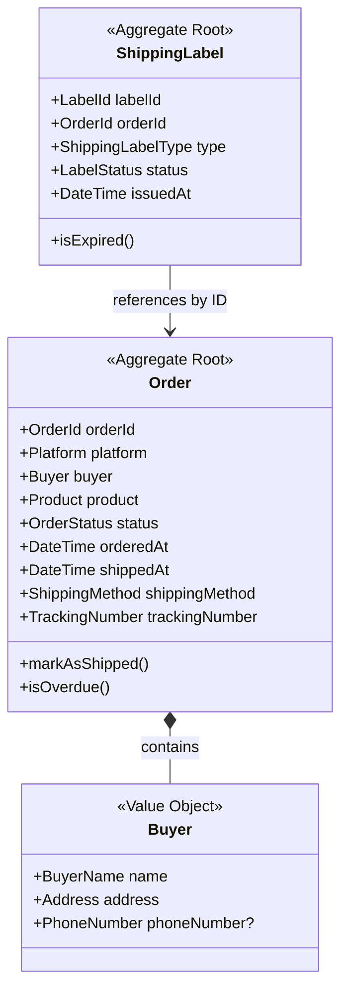
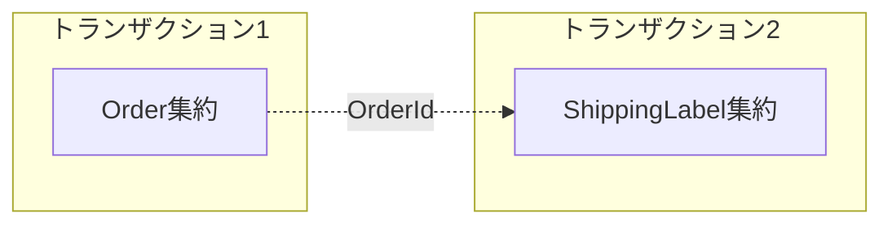
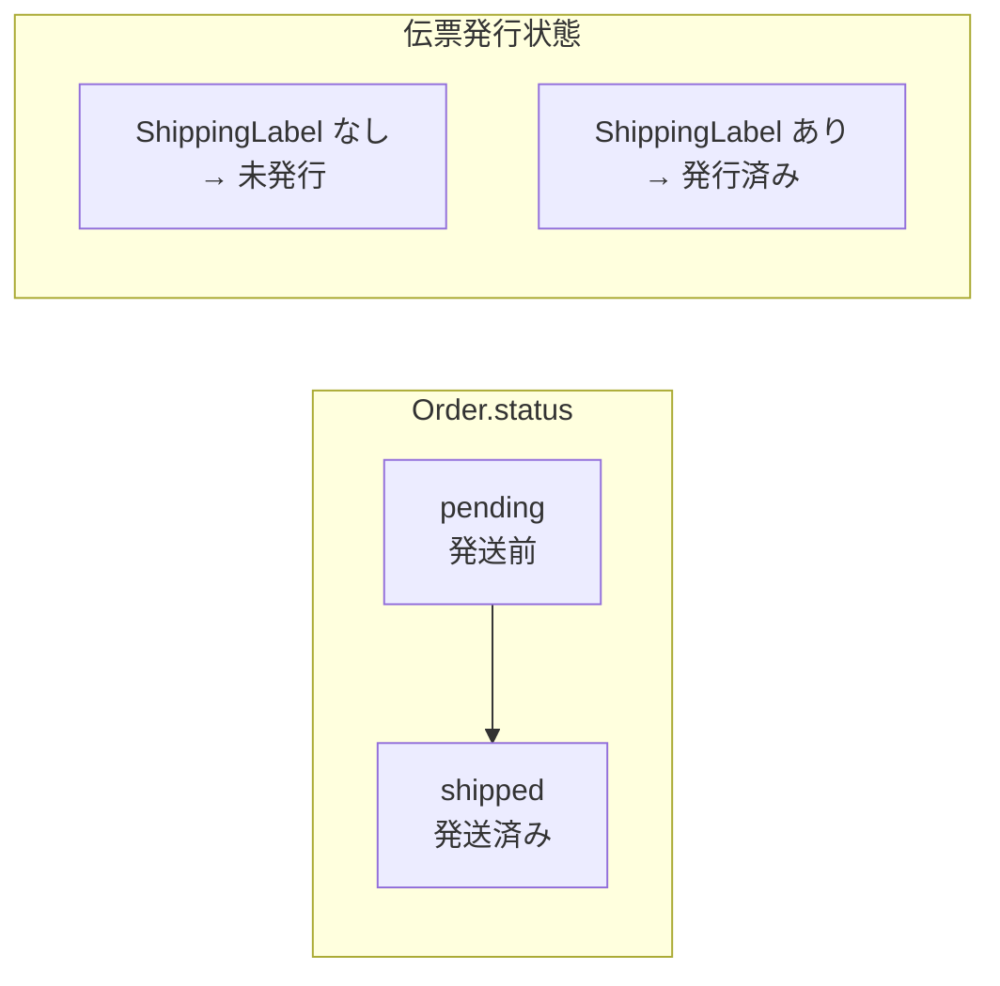
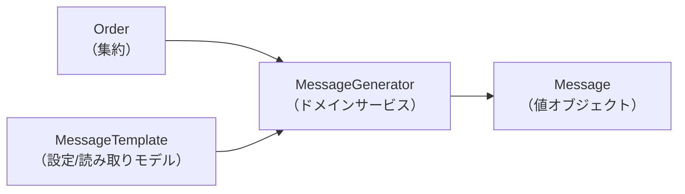
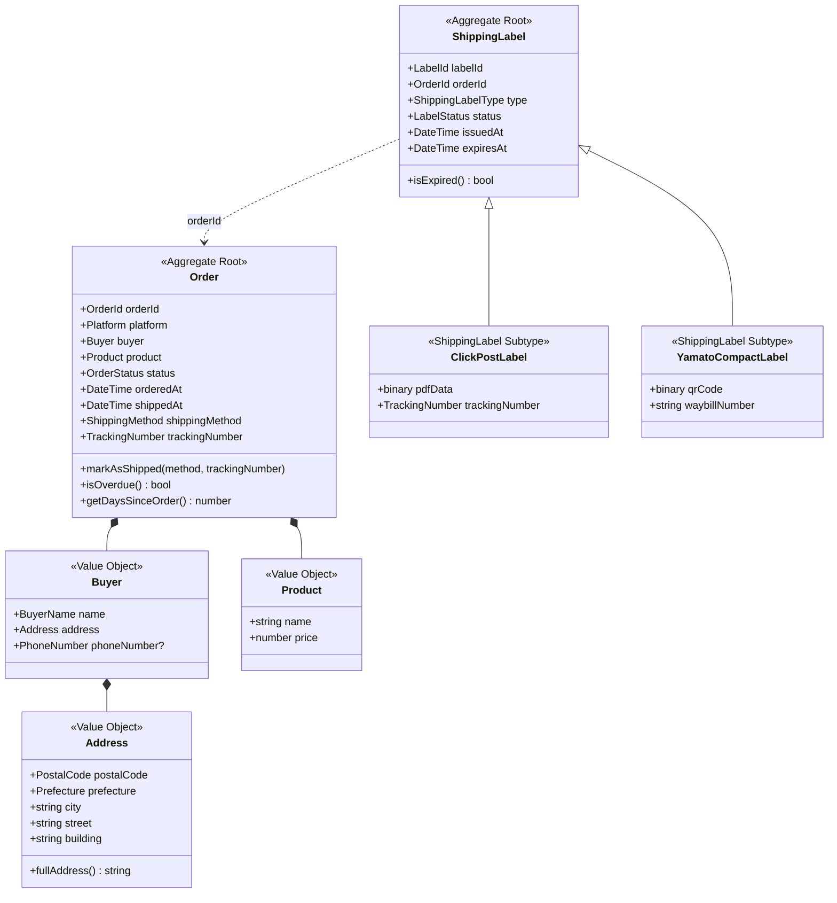
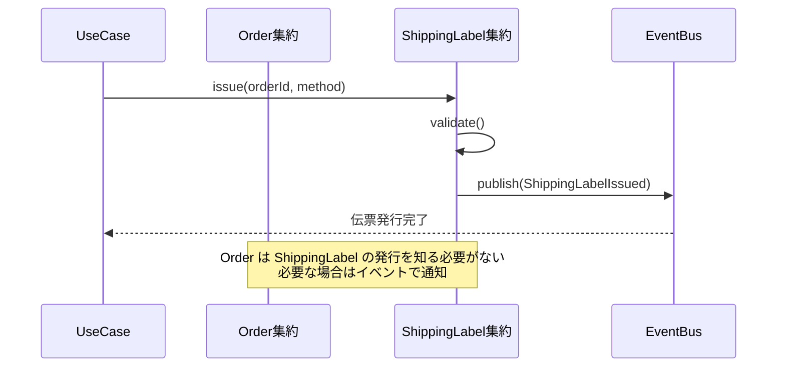

# 集約設計

## 概要

イベントストーミングで発見した検討事項を踏まえ、集約境界を検証・設計します。

## 集約設計の原則

DDDにおける集約設計の原則（Vaughn Vernon「実践ドメイン駆動設計」より）:

1. **真の不変条件をモデル化する** - 同一トランザクションで整合性を保つべきものを集約に含める
2. **小さな集約を設計する** - 大きすぎる集約はパフォーマンスと競合の問題を引き起こす
3. **IDで他の集約を参照する** - 集約間は直接参照ではなくIDで参照する
4. **結果整合性を受け入れる** - 集約間の整合性は結果整合性（イベント駆動）で実現

## 現在の集約構成



## 検討事項と結論

### 1. Order と ShippingLabel の関係

#### 問題
- ShippingLabel は OrderId で Order を参照している
- Order は ShippingLabel を持っていない
- これは正しい設計か？

#### 分析

**選択肢A: Order が ShippingLabel を含む（大きな集約）**
```
Order
├── Buyer
├── Product
└── ShippingLabel  ← Orderの一部
```

**選択肢B: 別々の集約（現在の設計）**
```
Order                    ShippingLabel
├── Buyer                └── orderId (参照)
└── Product
```

#### 結論: 選択肢B（別々の集約）を採用

理由:
1. **不変条件が異なる**: Order の整合性（購入者情報の正確性）と ShippingLabel の整合性（伝票の有効性）は独立
2. **ライフサイクルが異なる**: Order は注文時に作成、ShippingLabel は伝票発行時に作成
3. **1つの Order に複数の ShippingLabel**: 再発行の可能性を考えると1:Nの関係
4. **トランザクション境界**: 伝票発行失敗時に Order をロールバックする必要はない



### 2. 伝票発行時のステータス更新

#### 問題
- 伝票発行成功後、Order のステータスを更新すべきか？
- 現在: `pending` → `shipped` の2状態のみ

#### 分析

**選択肢A: 中間ステータスを追加**
```
pending → label_issued → shipped
```

**選択肢B: 現状維持（2状態）**
```
pending → shipped
```

#### 結論: 選択肢B（2状態）を維持

理由:
1. **ビジネス上の意味**: 「伝票発行済み」は作家の作業状態であり、ビジネス上の状態遷移ではない
2. **発送管理の本質**: 「発送前」か「発送済み」かが重要
3. **複雑性の回避**: 中間状態を増やすとステータス遷移が複雑になる
4. **代替案**: 伝票発行済みかどうかは ShippingLabel の存在で判断できる



ただし、UIでは「伝票発行済み」を表示する:
```typescript
// 読み取りモデル（UI用）
interface OrderView {
  status: 'pending' | 'shipped';
  labelIssued: boolean;  // ShippingLabel の存在から導出
}
```

### 3. メッセージテンプレートの位置づけ

#### 問題
- UC-008/009/010 のメッセージ機能をどうモデル化するか？
- Order の一部？独立した集約？

#### 分析

**選択肢A: Order に含める**
```
Order
├── Buyer
├── Product
└── generateThankYouMessage()
```

**選択肢B: 独立した集約 MessageTemplate**
```
MessageTemplate
├── templateId
├── type (purchase_thanks / shipping_notice)
└── content
```

**選択肢C: ドメインサービス + 読み取りモデル**
```
MessageGenerator (ドメインサービス)
├── generate(order, template)
└── return Message
```

#### 結論: 選択肢C（ドメインサービス + 設定）を採用

理由:
1. **Order の責務ではない**: メッセージ生成は Order の不変条件と無関係
2. **テンプレートは設定**: ビジネスルールではなくユーザー設定
3. **副作用がない**: メッセージ生成は純粋な変換処理



## 最終的な集約設計



## 集約間の整合性

### 結果整合性の実現



### トランザクション境界

| 操作 | トランザクション | 整合性 |
|-----|----------------|-------|
| 注文登録 | Order 単独 | 強整合性 |
| 伝票発行 | ShippingLabel 単独 | 強整合性 |
| 発送完了記録 | Order 単独 | 強整合性 |
| Order-ShippingLabel 間 | なし | 結果整合性 |

## 集約のルールまとめ

### Order 集約

| ルール | 説明 |
|-------|------|
| 作成時 | 必須項目（購入者名、住所、商品名）が揃っていること |
| ステータス遷移 | pending → shipped のみ許可 |
| 発送完了時 | 発送日時、配送方法を記録 |

### ShippingLabel 集約

| ルール | 説明 |
|-------|------|
| 作成時 | 対象 Order が pending であること |
| 有効期限 | 宅急便コンパクトは14日間 |
| 重複発行 | 警告を表示（禁止ではない） |

## 関連ドキュメント

- [ドメインモデル](./README.md)
- [イベントストーミング](./event-storming.md)
