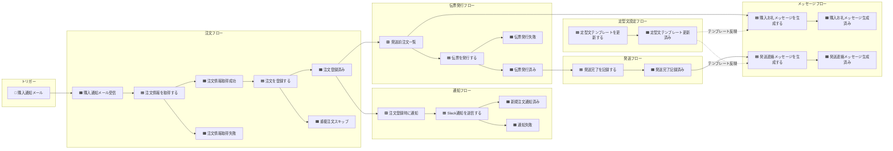
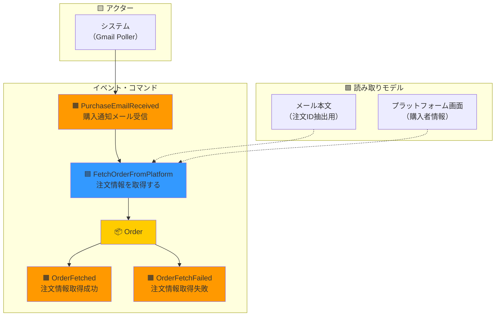
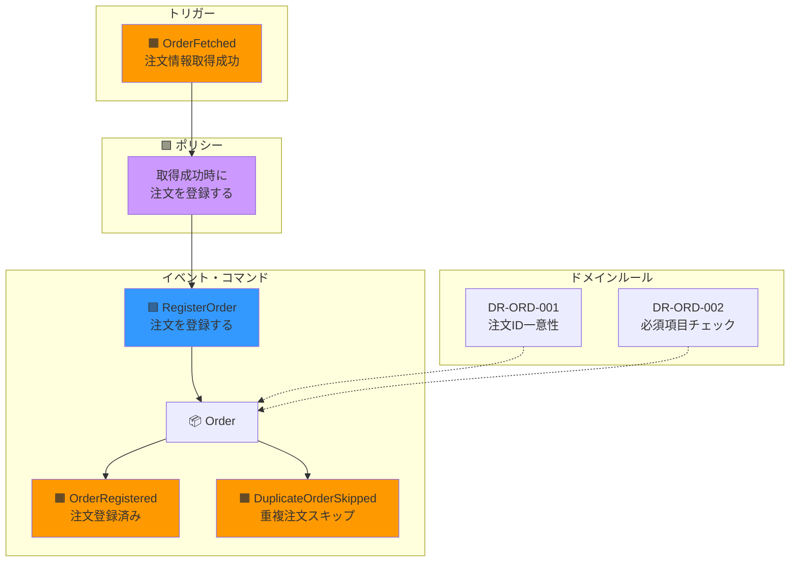
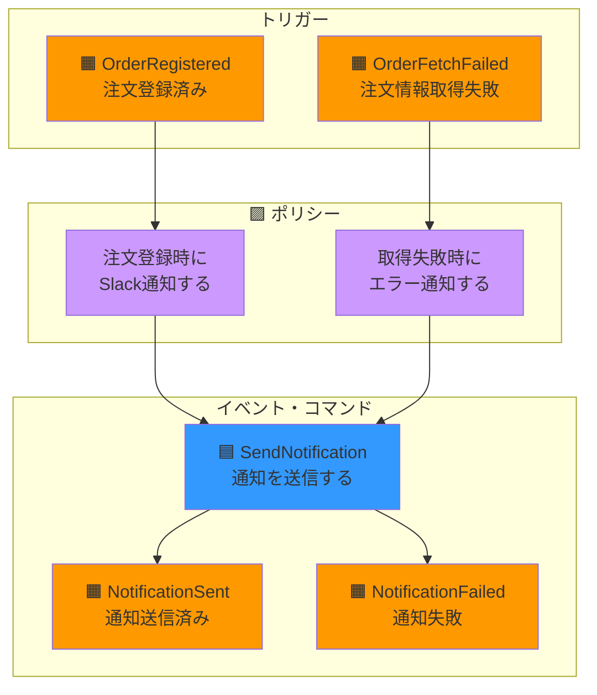
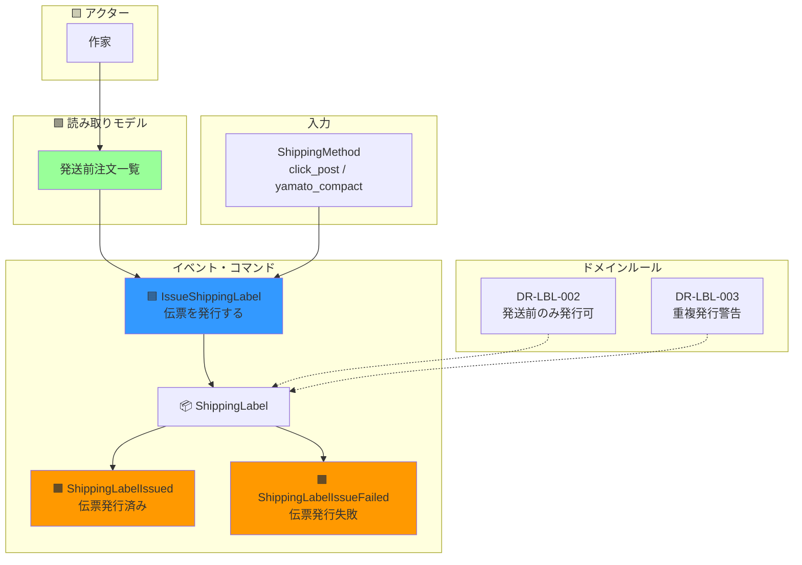
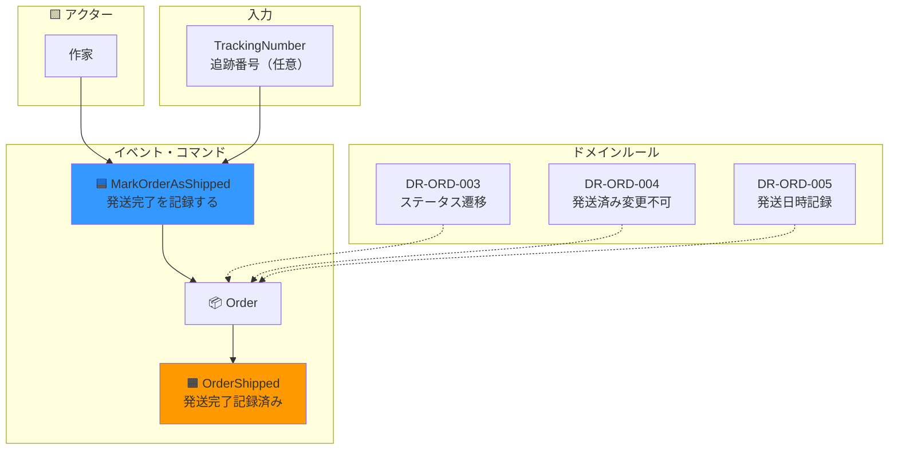
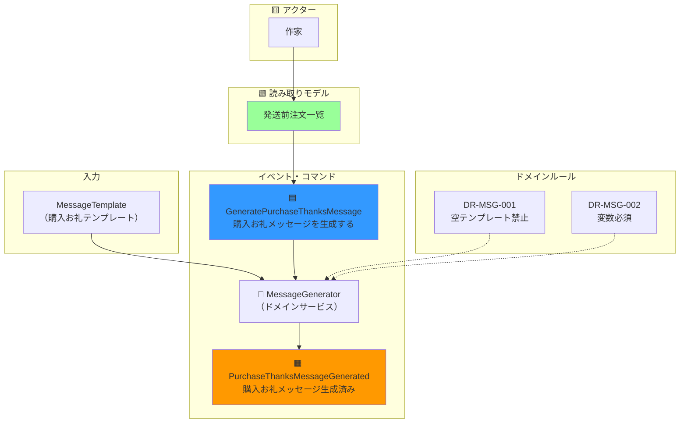
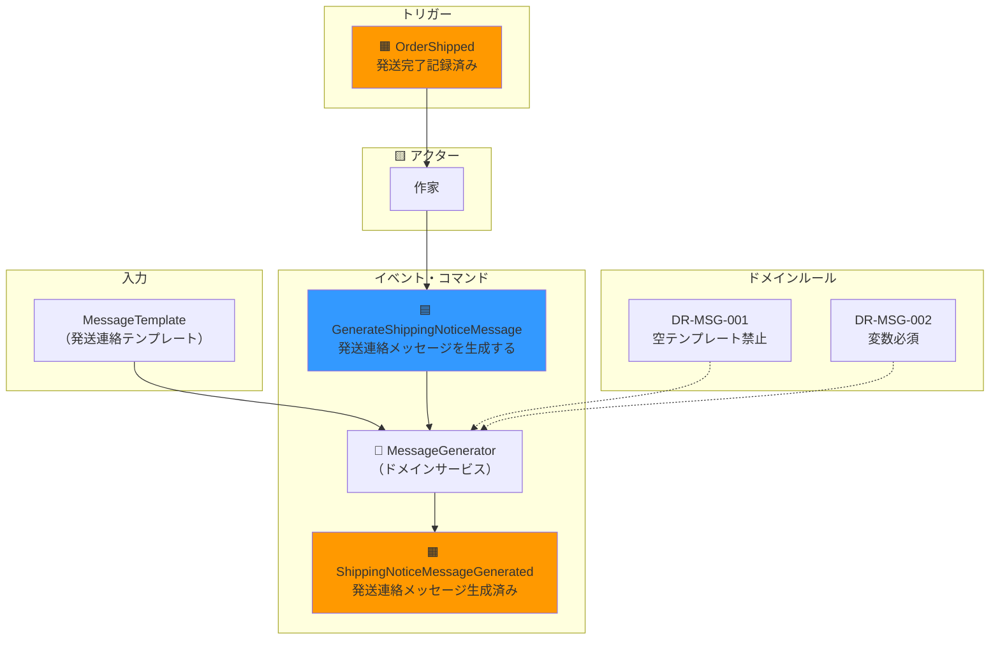
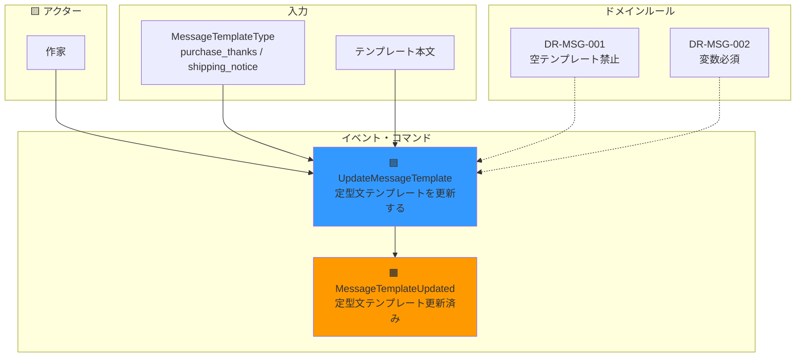

# イベントストーミング

## 概要

イベントストーミングはAlberto Brandoliniが考案したワークショップ手法で、
ドメインイベントを中心にシステムの振る舞いを可視化します。

## 凡例

| 色 | 要素 | 説明 |
|----|------|------|
| 🟧 オレンジ | ドメインイベント | 過去形で表現。「〜された」 |
| 🟦 青 | コマンド | 命令形で表現。「〜する」 |
| 🟨 黄 | アクター | コマンドを発行する人・システム |
| 🟪 紫 | ポリシー | イベントに反応して次のコマンドを発行 |
| 🟩 緑 | 読み取りモデル | 意思決定に必要な情報 |
| 📦 | 集約 | コマンドを処理しイベントを発行 |

## イベントフロー全体図

## 詳細イベントストーミング

### 1. 注文取得フロー

### 2. 注文登録フロー

### 3. 通知フロー

### 4. 伝票発行フロー

### 5. 発送完了フロー

### 6. メッセージ生成フロー（購入お礼）

### 7. メッセージ生成フロー（発送連絡）

### 8. 定型文設定フロー

## ドメインイベント一覧

| イベント名 | 日本語名 | 発生条件 | 発行元集約 |
|-----------|---------|---------|-----------|
| PurchaseEmailReceived | 購入通知メール受信 | Gmailで購入通知検出 | - |
| OrderFetched | 注文情報取得成功 | プラットフォームから情報取得成功 | Order |
| OrderFetchFailed | 注文情報取得失敗 | プラットフォームから情報取得失敗 | - |
| OrderRegistered | 注文登録済み | 新規注文がスプレッドシートに保存 | Order |
| DuplicateOrderSkipped | 重複注文スキップ | 既存の注文IDと重複 | Order |
| NotificationSent | 通知送信済み | Slack通知成功 | - |
| NotificationFailed | 通知失敗 | Slack通知失敗 | - |
| ShippingLabelIssued | 伝票発行済み | 伝票PDF/QRコード発行成功 | ShippingLabel |
| ShippingLabelIssueFailed | 伝票発行失敗 | 伝票発行失敗 | - |
| OrderShipped | 発送完了記録済み | ステータスが発送済みに変更 | Order |
| PurchaseThanksMessageGenerated | 購入お礼メッセージ生成済み | 購入お礼メッセージが生成された | - |
| ShippingNoticeMessageGenerated | 発送連絡メッセージ生成済み | 発送連絡メッセージが生成された | - |
| MessageTemplateUpdated | 定型文テンプレート更新済み | テンプレートが保存された | - |

## コマンド一覧

| コマンド名 | 日本語名 | 発行者 | 対象集約 |
|-----------|---------|-------|---------|
| FetchOrderFromPlatform | 注文情報を取得する | システム | Order |
| RegisterOrder | 注文を登録する | システム | Order |
| SendNotification | 通知を送信する | システム | - |
| IssueShippingLabel | 伝票を発行する | 作家 | ShippingLabel |
| MarkOrderAsShipped | 発送完了を記録する | 作家 | Order |
| GeneratePurchaseThanksMessage | 購入お礼メッセージを生成する | 作家 | - (ドメインサービス) |
| GenerateShippingNoticeMessage | 発送連絡メッセージを生成する | 作家 | - (ドメインサービス) |
| UpdateMessageTemplate | 定型文テンプレートを更新する | 作家 | - (設定) |

## ポリシー一覧

| ポリシー | トリガーイベント | 発行コマンド |
|---------|-----------------|-------------|
| 注文取得成功時に登録 | OrderFetched | RegisterOrder |
| 注文登録時に通知 | OrderRegistered | SendNotification |
| 取得失敗時にエラー通知 | OrderFetchFailed | SendNotification |

## 気づき・検討事項

### 集約境界の確認ポイント

以下の検討事項は[集約設計](./aggregate-design.md)で解決済みです。

1. **Order と ShippingLabel の関係** → **解決済み**: 別々の集約（IDで参照）
   - ShippingLabel は Order を参照するが、Order は ShippingLabel を持たない
   - 不変条件・ライフサイクルが異なるため、別々の集約が適切

2. **伝票発行時のステータス更新** → **解決済み**: 2状態（pending → shipped）を維持
   - 「伝票発行済み」は ShippingLabel の存在で判断できる
   - 中間状態を増やすことによる複雑性を回避

3. **メッセージテンプレートの位置づけ** → **解決済み**: ドメインサービス + 設定
   - MessageGenerator（ドメインサービス）が Order + MessageTemplate から Message を生成
   - MessageTemplate は集約ではなく設定/読み取りモデルとして扱う

## 関連ドキュメント

- [集約境界の検証](./aggregate-design.md) - 上記の検討事項の詳細な分析と結論
- [ドメインモデル](./README.md) - エンティティ、値オブジェクト、ドメインサービスの定義
