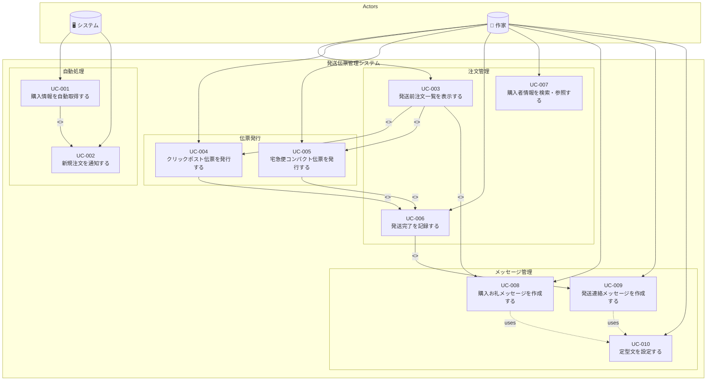
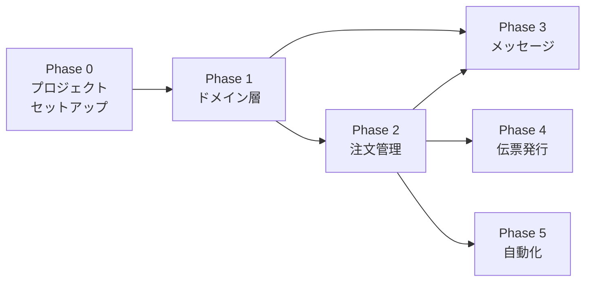

# ユースケース一覧

## 概要

ハンドメイド作品の発送伝票管理システムのユースケースを定義します。
松岡幸一郎氏のドメイン駆動設計入門に基づき、ユースケースを整理しています。

## システムの前提

- Gmailの購入通知メールをトリガーとして自動処理を開始
- メールから注文IDを抽出し、Playwrightでminne/creemaから購入者情報を取得
- 取得した情報をスプレッドシートに保存

## ドメインルールとの関係

ユースケースで適用されるビジネスルールは[ドメインモデル](../domain/README.md#ドメインルールdomain-rules)に定義されています。
ユースケース内の「関連ドメインルール」セクションでは、該当するルールIDを参照しています。

## アクター

| アクター | 説明 |
|---------|------|
| 作家 | ハンドメイド作品を制作・販売する人。発送作業を行う |
| システム | 自動処理を行うシステム（メール監視、情報取得、通知など） |

## ユースケース図



## ユースケース一覧

| ID | ユースケース名 | アクター | フェーズ | 詳細 |
|----|---------------|---------|---------|------|
| UC-001 | [購入情報を自動取得する](./UC-001_購入情報を自動取得する.md) | システム | Phase 5 | メールから注文IDを抽出し、Playwrightで購入者情報を取得 |
| UC-002 | [新規注文を通知する](./UC-002_新規注文を通知する.md) | システム | Phase 5 | 新規注文をSlackで通知 |
| UC-003 | [発送前注文一覧を表示する](./UC-003_発送前注文一覧を表示する.md) | 作家 | Phase 2 | 未発送の注文を一覧表示 |
| UC-004 | [クリックポスト伝票を発行する](./UC-004_クリックポスト伝票を発行する.md) | 作家 | Phase 4 | クリックポストのPDF伝票を発行 |
| UC-005 | [宅急便コンパクト伝票を発行する](./UC-005_宅急便コンパクト伝票を発行する.md) | 作家 | Phase 4 | ヤマト運輸PUDOのQRコードを発行 |
| UC-006 | [発送完了を記録する](./UC-006_発送完了を記録する.md) | 作家 | Phase 2 | 発送完了ステータスを更新 |
| UC-007 | [購入者情報を検索・参照する](./UC-007_購入者情報を検索・参照する.md) | 作家 | Phase 2 | 過去の購入者情報を検索・閲覧 |
| UC-008 | [購入お礼メッセージを作成する](./UC-008_購入お礼メッセージを作成する.md) | 作家 | Phase 3 | 購入者への定型お礼メッセージを生成・コピー |
| UC-009 | [発送連絡メッセージを作成する](./UC-009_発送連絡メッセージを作成する.md) | 作家 | Phase 3 | 発送完了時の定型連絡メッセージを生成・コピー |
| UC-010 | [定型文を設定する](./UC-010_定型文を設定する.md) | 作家 | Phase 3 | 購入お礼・発送連絡の定型文テンプレートを編集 |

## 実装フェーズ

依存関係とビジネス価値に基づく実装順序です。

### Phase 0: プロジェクトセットアップ

| タスク | 内容 |
|-------|------|
| 環境構築 | Next.js + TypeScript + テスト環境（Vitest） |
| ディレクトリ構成 | ヘキサゴナルアーキテクチャに基づく構成 |
| CI/リンター | ESLint, Prettier 設定 |

### Phase 1: ドメイン層（コア）

外部依存なし。全てのフェーズの土台。

| 優先度 | 対象 | 内容 |
|--------|------|------|
| 1-1 | 値オブジェクト | OrderId, Platform, OrderStatus, ShippingMethod, PostalCode, Prefecture, BuyerName, PhoneNumber, TrackingNumber, Address |
| 1-2 | エンティティ・集約 | Order, ShippingLabel (ClickPostLabel, YamatoCompactLabel) |
| 1-3 | ポート（インターフェース） | OrderRepository, ShippingLabelRepository, OrderFetcher, ShippingLabelIssuer, NotificationSender |
| 1-4 | ドメインサービス | MessageGenerator, MessageTemplate, Message |
| 1-5 | 仕様 | OverdueOrderSpecification |

### Phase 2: 注文管理（基本フロー）

作家が日常的に使う最も基本的な機能。

| 優先度 | ユースケース | 依存 | 理由 |
|--------|-------------|------|------|
| 2-1 | UC-003 発送前注文一覧を表示する | Phase 1 | 最もシンプルな読み取り専用UC。UIの起点 |
| 2-2 | UC-006 発送完了を記録する | Phase 1 | Order集約のコア操作 |
| 2-3 | UC-007 購入者情報を検索・参照する | Phase 1 | 読み取り専用。UC-003と並行開発可能 |

### Phase 3: メッセージ機能

注文管理と組み合わせて使う機能。外部連携なし。

| 優先度 | ユースケース | 依存 | 理由 |
|--------|-------------|------|------|
| 3-1 | UC-010 定型文を設定する | Phase 1 | UC-008/009の前提条件 |
| 3-2 | UC-008 購入お礼メッセージを作成する | Phase 2, 3-1 | MessageGenerator + Order |
| 3-3 | UC-009 発送連絡メッセージを作成する | Phase 2, 3-1 | MessageGenerator + Order + 発送情報 |

### Phase 4: 伝票発行（外部連携あり）

Playwright による外部サイト操作が必要。最も実装リスクが高い。

| 優先度 | ユースケース | 依存 | 理由 |
|--------|-------------|------|------|
| 4-1 | UC-004 クリックポスト伝票を発行する | Phase 2 | 外部連携（Playwright + クリックポスト） |
| 4-2 | UC-005 宅急便コンパクト伝票を発行する | Phase 2 | 外部連携（Playwright + ヤマト運輸） |

### Phase 5: 自動化パイプライン（外部連携あり）

Gmail監視 + Playwright + Slack。バックグラウンド自動処理。

| 優先度 | ユースケース | 依存 | 理由 |
|--------|-------------|------|------|
| 5-1 | UC-001 購入情報を自動取得する | Phase 2 | Gmail API + Playwright + スプレッドシート |
| 5-2 | UC-002 新規注文を通知する | 5-1 | UC-001成功後のSlack通知 |

### フェーズ依存関係



### フェーズ設計の意図

1. **Phase 1 を先に完成させる**: ドメイン層は全ての土台。外部依存なしでテスト可能
2. **Phase 2-3 は外部連携なし**: UIとドメインロジックのみで完結。早期に「使えるアプリ」になる
3. **Phase 4-5 は外部連携あり**: Playwright 操作は不安定要素が多いため後回し。Phase 2-3が動いていれば手動入力でも運用可能

## 対応プラットフォーム

- minne
- creema
- （将来的に拡張可能）

## 対応配送方法

- クリックポスト（日本郵便）
- 宅急便コンパクト（ヤマト運輸 / PUDO）

## 基本的な処理フロー

```
1. 【自動】Gmailで購入通知メールを検知
        ↓
2. 【自動】メールから注文IDを抽出
        ↓
3. 【自動】Playwrightでminne/creemaにアクセス
        ↓
4. 【自動】注文IDから購入者情報を取得
        ↓
5. 【自動】スプレッドシートに保存
        ↓
6. 【自動】Slackで通知 + アプリに「発送前」として表示
        ↓
7. 【手動】購入お礼メッセージをコピー → minne/creemaで送信
        ↓
8. 【手動】作家が伝票発行ボタンをクリック
        ↓
9. 【自動】Playwrightでクリックポスト/宅急便コンパクトの伝票を発行
        ↓
10.【手動】作家が実際に発送
        ↓
11.【手動】作家が発送完了を記録
        ↓
12.【手動】発送連絡メッセージをコピー → minne/creemaで送信
```
