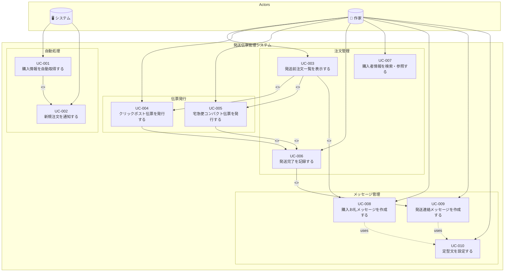

# ユースケース一覧

## 概要

ハンドメイド作品の発送伝票管理システムのユースケースを定義します。
松岡幸一郎氏のドメイン駆動設計入門に基づき、ユースケースを整理しています。

## システムの前提

- Gmailの購入通知メールをトリガーとして自動処理を開始
- メールから注文IDを抽出し、Playwrightでminne/creemaから購入者情報を取得
- 取得した情報をスプレッドシートに保存

## ドメインルールとの関係

ユースケースで適用されるビジネスルールは[ドメインモデル](../domain/README.md#ドメインルールdomain-rules)に定義されています。
ユースケース内の「関連ドメインルール」セクションでは、該当するルールIDを参照しています。

## アクター

| アクター | 説明 |
|---------|------|
| 作家 | ハンドメイド作品を制作・販売する人。発送作業を行う |
| システム | 自動処理を行うシステム（メール監視、情報取得、通知など） |

## ユースケース図



## ユースケース一覧

| ID | ユースケース名 | アクター | 優先度 | 詳細 |
|----|---------------|---------|--------|------|
| UC-001 | [購入情報を自動取得する](./UC-001_購入情報を自動取得する.md) | システム | 高 | メールから注文IDを抽出し、Playwrightで購入者情報を取得 |
| UC-002 | [新規注文を通知する](./UC-002_新規注文を通知する.md) | システム | 高 | 新規注文をSlackで通知 |
| UC-003 | [発送前注文一覧を表示する](./UC-003_発送前注文一覧を表示する.md) | 作家 | 高 | 未発送の注文を一覧表示 |
| UC-004 | [クリックポスト伝票を発行する](./UC-004_クリックポスト伝票を発行する.md) | 作家 | 高 | クリックポストのPDF伝票を発行 |
| UC-005 | [宅急便コンパクト伝票を発行する](./UC-005_宅急便コンパクト伝票を発行する.md) | 作家 | 高 | ヤマト運輸PUDOのQRコードを発行 |
| UC-006 | [発送完了を記録する](./UC-006_発送完了を記録する.md) | 作家 | 高 | 発送完了ステータスを更新 |
| UC-007 | [購入者情報を検索・参照する](./UC-007_購入者情報を検索・参照する.md) | 作家 | 中 | 過去の購入者情報を検索・閲覧 |
| UC-008 | [購入お礼メッセージを作成する](./UC-008_購入お礼メッセージを作成する.md) | 作家 | 高 | 購入者への定型お礼メッセージを生成・コピー |
| UC-009 | [発送連絡メッセージを作成する](./UC-009_発送連絡メッセージを作成する.md) | 作家 | 高 | 発送完了時の定型連絡メッセージを生成・コピー |
| UC-010 | [定型文を設定する](./UC-010_定型文を設定する.md) | 作家 | 高 | 購入お礼・発送連絡の定型文テンプレートを編集 |

## 対応プラットフォーム

- minne
- creema
- （将来的に拡張可能）

## 対応配送方法

- クリックポスト（日本郵便）
- 宅急便コンパクト（ヤマト運輸 / PUDO）

## 基本的な処理フロー

```
1. 【自動】Gmailで購入通知メールを検知
        ↓
2. 【自動】メールから注文IDを抽出
        ↓
3. 【自動】Playwrightでminne/creemaにアクセス
        ↓
4. 【自動】注文IDから購入者情報を取得
        ↓
5. 【自動】スプレッドシートに保存
        ↓
6. 【自動】Slackで通知 + アプリに「発送前」として表示
        ↓
7. 【手動】購入お礼メッセージをコピー → minne/creemaで送信
        ↓
8. 【手動】作家が伝票発行ボタンをクリック
        ↓
9. 【自動】Playwrightでクリックポスト/宅急便コンパクトの伝票を発行
        ↓
10.【手動】作家が実際に発送
        ↓
11.【手動】作家が発送完了を記録
        ↓
12.【手動】発送連絡メッセージをコピー → minne/creemaで送信
```
